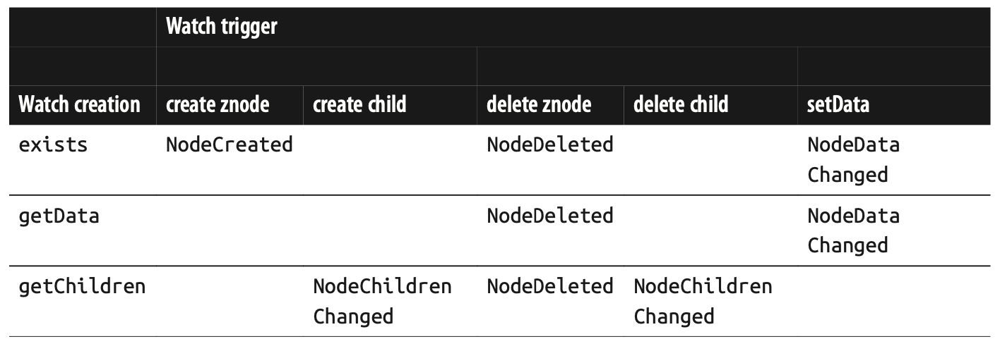
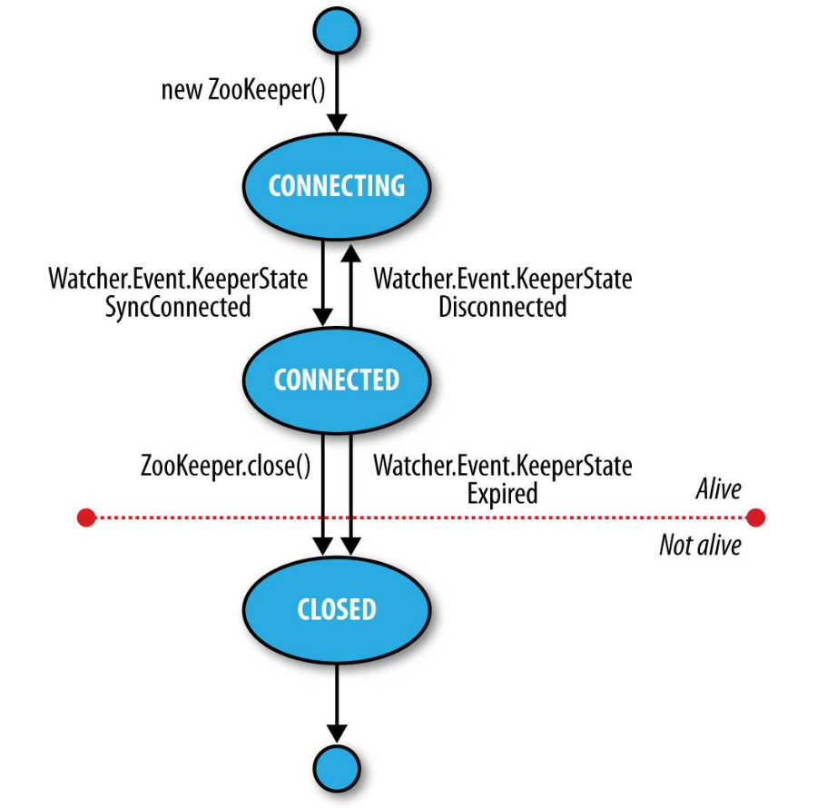

#### Implementation

> ZooKeeper achieves high availability through replication.
>
> Every update made to the znode tree is given a globally unique identifier, called a `zxid`

需要有过半的节点存活，服务才可用，所以一般会使用奇数个节点的集群。

Using a protocal called **Zab** that runs in two phases:

- Phase 1, Leader election. `leader-followers` style. 选举过程会很快（200ms）
- Phase 2, Atomic broadcast.所有的写请求都会路由到`leader`，然后把更新广播给`followers`

所有的节点都会先把**更新**写到磁盘，之后再更新内存中的数据结构（znode tree）

#### Data Model

> A znode stores data and has an associated ACL. The stores data limit of **1M**.

Data access is atomic. 

The reading result either the data will be delivered in its entirety or the read will fail.

The writing will replace all the data, not support an append operation.

##### Ephemeral znodes

Deleted when the creating client's session ends.

An ephemeral znode may **not have children**, not even ephemeral ones.

##### Sequence numbers

> If a znode is created with the sequential flag set;
>
> Impose a global ordering;

Eg: `/a/b-2`, next will be given a unique name with a larger value of the counter, `/a/b-3`

##### Watches

> Watchers are triggered only once. To receive multiple notifications, a client needs to reregister the watch.

Watches are set by **operations on the ZooKeeper service**; triggered by other operations on the service.

不同的**读操作**可以订阅不同的**写事件**:

#### ACLs，权限控制

支持三种类型：`digest`，`sasl`，`ip`；控制维度是`znode`，创建的时候指定权限，后续有权限的用户可以修改。

| ACL permission | Permitted operations  |
| -------------- | --------------------- |
| CREATE         | create(a child znode) |
| READ           | getChildren / getData |
| WRITE          | setData               |
| DELETE         | delete(a child znode) |
| ADMIN          | setACL                |

#### Session

一旦和服务端建立好连接，服务器端就会为这个客户端建立一个新会话(Session)。会话会有心跳保持，如果会话超时或者断开，那么`ephemeral node`就会失效。

服务端节点失效重连，不会导致Session失效。

#### State

客户端使用的`ZooKeeper`实例，是一个状态机：`CONNECTING`， `CONNECTED`，`CLOSED`。

**注意**：Zookeeper Watcher有两个作用：

- 默认是监听ZooKeeper State变化的
- 另外就是监听znode的变化。有些方法可以新指定Watcher；如果没有指定，并且传了`true`，那么会复用`new ZooKeeper`时的这个Watcher

#### 分布式锁原理

几个基础能力使得ZK可以实现分布式锁：带全局序列的临时节点、会话保持（失效删除对应临时节点）、通知机制。

- 首先，创建一个持久化节点，好比就是一个锁，起名为`/leader`
- 第一步，在`/leader`下面创建`ephemeral sequential znode`，起名前缀为`/leader/lock-[No.]`
- 第二步，获取`/leader`的所有子节点，并且监听这个节点的变化
- 第三步，如果第一步创建的临时节点的序列号，是最小的，那它就获得了锁；
- 第四步，如果有变更（释放锁、会话过期）通知，则重新走第二步

这个算法有两个问题：通知惊群、第一步这个操作不是幂等的（不可重复创建同名节点，一般会在节点名上标记全局唯一会话ID）

